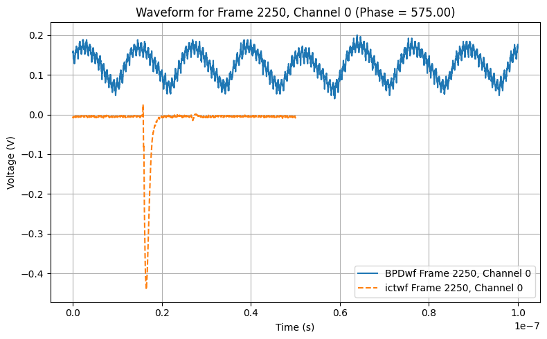
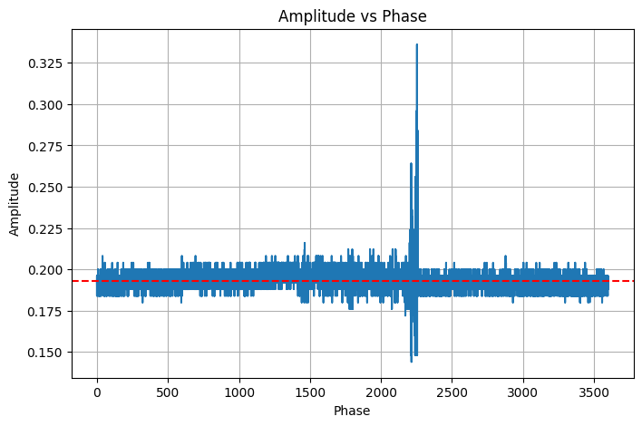

# ANL_Experiment_Data_Extraction

## Overview
Project created through Undergraduate Research Program at RPI. Data was collected from an experiment at Argonne National Lab (ANL) in summer 2025. This code can take a `.npz` file storing results and extract features needed for analysis

## Work Flow
### Data
ANL exported experiment results in `.npz` files with the following arrays and dimmensions:
* x (1,N): Time axis for experiments
* BPDwf (M,3,N): Wave form data collected from a Bipolar Diode (*pictured in blue below*). Collected for all M phase angles, at time n $\in$ N, collected via 3 different channels simulaneously 
* ictwf (M,3,N): Wave form data collected from a Integrating Current Transformer (*pictured in orange below*). Collected for all M phase angles, at time n $\in$ N, collected via 3 different channels simulaneously  
* phase (M,1): All M phase angles used durring the experiment    

*figure 1. Example Output from single phase angle*

### Feature Extraction
The main feature extracted from this data is a graph of all local maxima collected from a given phase angle of the BPD wave forms. This is done via the following:

#### Find Local Extremas
>1. Import and store BPD wave forms
>1. For a given wave, smooth it by caluculating a moving average
>1. Use the smoothed graph to seperate all wave lengths into regions with either a local minima or maxima. 
>1. Find and store local extremas
>1. Repeat 2-4 for all phase angles

#### Viewing Results
>1. Import extremas data
>1. Graph local maximas as a function of phase angle (*graph below*)

